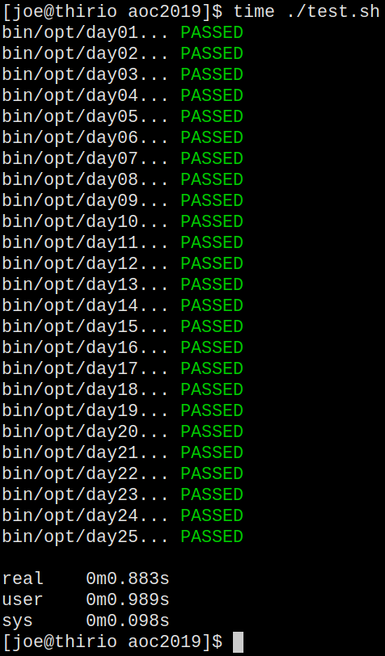

# Advent of Code 2019

This repo contains my solutions to Advent of Code 2019. I am using C++ modules
(the clang9 flavour) to see how mature the support is (spoiler alert, it's
buggy).

## Compilation

Simply run `make` for a debug build or `make opt` for an optimized build. If
things get stuck, try `make clean` to start from a clean slate.

## Usage

Each puzzle accepts its input as a single argument that refers to a file:

    $ make
    $ bin/dayNN puzzles/dayNN.txt
